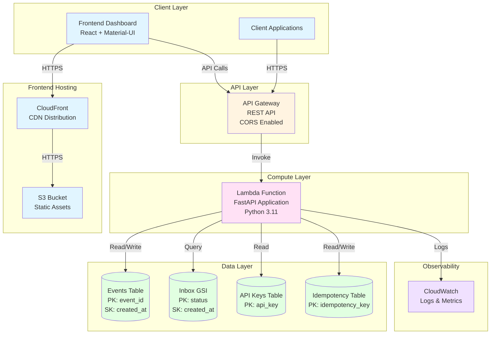
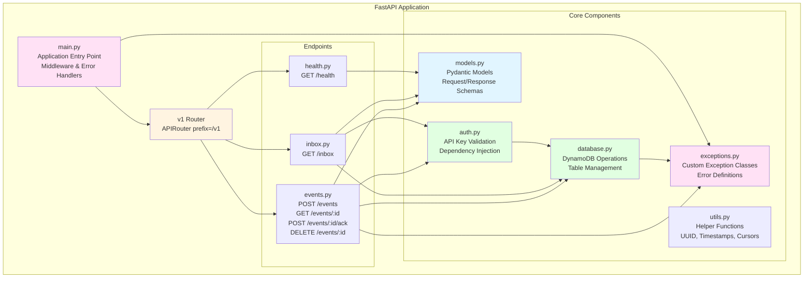
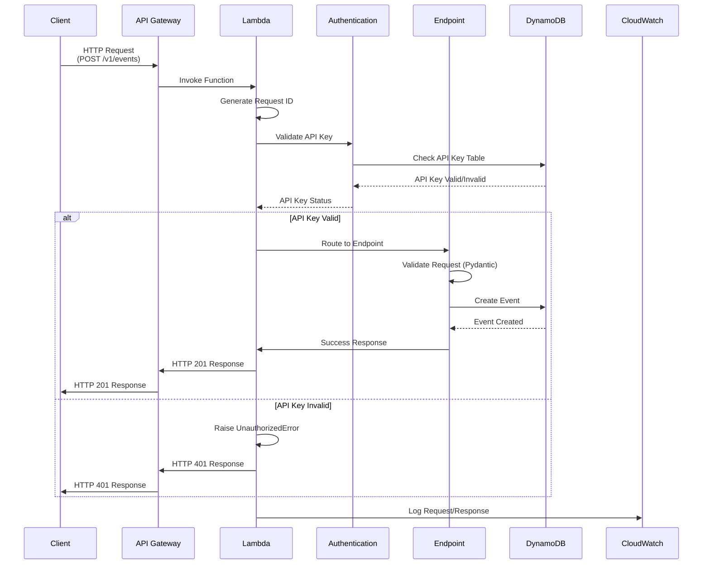
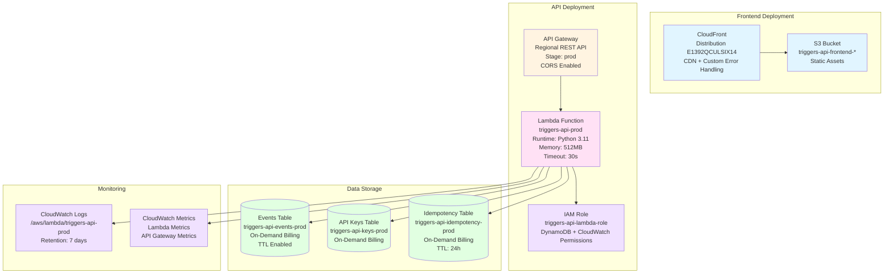
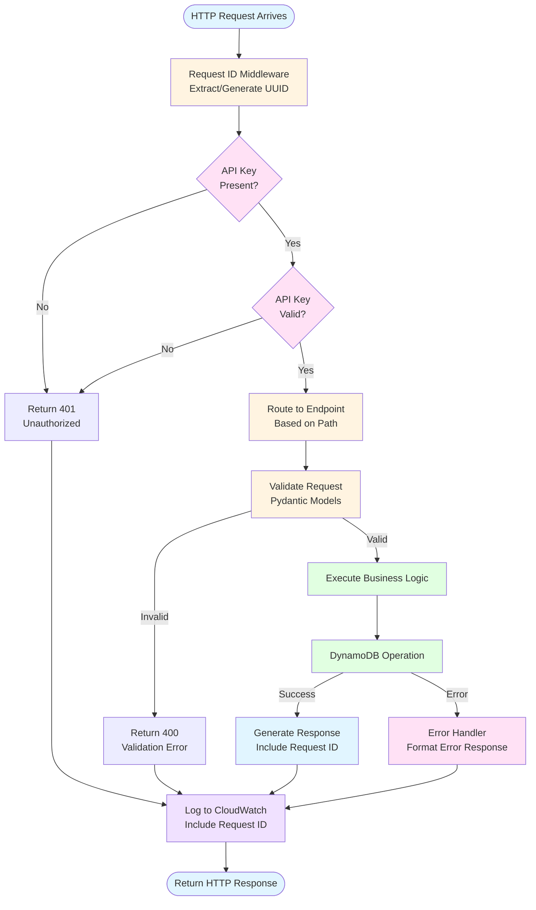

# System Architecture

Complete architecture documentation for the Zapier Triggers API.

## Table of Contents

- [Overview](#overview)
- [System Architecture](#system-architecture)
- [Component Architecture](#component-architecture)
- [Data Flow](#data-flow)
- [Deployment Architecture](#deployment-architecture)
- [Request Flow](#request-flow)
- [Component Descriptions](#component-descriptions)
- [Design Patterns](#design-patterns)

---

## Overview

The Zapier Triggers API is a serverless, event-driven REST API built on AWS. It provides a unified interface for ingesting and managing events, enabling real-time event-driven automations and workflows.

**Key Characteristics:**
- Serverless architecture (AWS Lambda)
- Event-driven design
- RESTful API with versioning (`/v1`)
- API key authentication
- DynamoDB for data persistence
- Auto-scaling and on-demand billing

---

## System Architecture

High-level system architecture showing all major components and their interactions.



**Key Components:**
- **Client Applications**: External systems sending events via REST API
- **Frontend Dashboard**: React-based web UI for testing and managing events
- **API Gateway**: Managed REST API with CORS support
- **Lambda Function**: FastAPI application handling all API requests
- **DynamoDB Tables**: Event storage, API key management, and idempotency tracking
- **CloudWatch**: Logging and monitoring

---

## Component Architecture

Detailed view of the FastAPI application structure and internal components.



**Component Relationships:**
- **main.py**: Orchestrates the application, registers routers, middleware, and error handlers
- **Endpoints**: Handle HTTP requests and delegate to business logic
- **auth.py**: Validates API keys before endpoint execution
- **database.py**: Abstracts DynamoDB operations
- **models.py**: Defines request/response schemas with validation
- **exceptions.py**: Provides standardized error handling

---

## Data Flow

Data flow diagram showing request and response paths through the system.



**Flow Steps:**
1. **Request Arrival**: Client sends HTTP request to API Gateway
2. **Request ID Generation**: Lambda middleware generates/extracts request ID
3. **Authentication**: API key validated against DynamoDB
4. **Routing**: Request routed to appropriate endpoint
5. **Validation**: Pydantic validates request payload
6. **Database Operation**: DynamoDB operation executed
7. **Response Generation**: Success or error response created
8. **Logging**: Request/response logged to CloudWatch

---

## Deployment Architecture

AWS deployment architecture showing all services and their configuration.



**Deployment Details:**
- **Frontend**: S3 static hosting + CloudFront CDN with custom error responses for SPA routing
- **API Gateway**: Regional REST API with `/v1/{proxy+}` catch-all route
- **Lambda**: Python 3.11 runtime, 512MB memory, 30s timeout
- **DynamoDB**: On-demand billing, TTL enabled for automatic cleanup
- **IAM**: Role with permissions for DynamoDB operations and CloudWatch logging

---

## Request Flow

Detailed step-by-step request processing flow.



**Processing Steps:**
1. **Request ID Middleware**: Extracts `X-Request-ID` header or generates UUID v4
2. **Authentication Check**: Validates `X-API-Key` header
3. **Routing**: Routes to appropriate endpoint based on path
4. **Validation**: Pydantic validates request payload
5. **Business Logic**: Endpoint-specific logic execution
6. **Database Operation**: DynamoDB read/write operation
7. **Response Generation**: Success response with request ID
8. **Error Handling**: Standardized error response if errors occur
9. **Logging**: Structured logging to CloudWatch with request ID

---

## Component Descriptions

### FastAPI Application (`src/main.py`)

**Purpose**: Application entry point that orchestrates all components.

**Key Responsibilities:**
- Initialize FastAPI application
- Register API routers with version prefix (`/v1`)
- Configure middleware (request ID tracking, CORS)
- Register exception handlers for error standardization
- Create DynamoDB tables on startup
- Configure structured JSON logging

**Key Functions:**
- `handler`: Lambda handler function (Mangum adapter)
- Request ID middleware: Extracts/generates request ID
- Exception handlers: Standardize error responses

**Code Reference**: ```1:50:src/main.py```

---

### DynamoDB Storage (`src/database.py`)

**Purpose**: Abstracts all DynamoDB operations and table management.

**Key Responsibilities:**
- DynamoDB resource initialization (local vs AWS)
- Table creation and management
- Event CRUD operations
- Inbox querying with pagination
- API key validation queries
- Idempotency key management

**Key Functions:**
- `create_event()`: Create new event in Events table
- `get_event()`: Retrieve event by ID
- `acknowledge_event()`: Update event status to acknowledged
- `delete_event()`: Delete event from table
- `get_inbox()`: Query pending events with pagination and filtering
- `check_idempotency_key()`: Check for existing idempotency key
- `store_idempotency_key()`: Store idempotency key mapping

**Tables Managed:**
- Events table: `triggers-api-events-{stage}`
- API Keys table: `triggers-api-keys-{stage}`
- Idempotency table: `triggers-api-idempotency-{stage}`

**Code Reference**: ```1:50:src/database.py```

---

### Authentication Layer (`src/auth.py`)

**Purpose**: Validates API keys for authenticated endpoints.

**Key Responsibilities:**
- Extract API key from `X-API-Key` header
- Validate API key (local mode or AWS mode)
- Support dual-mode authentication (local/AWS)
- Raise `UnauthorizedError` for invalid keys

**Key Functions:**
- `validate_api_key()`: FastAPI dependency for API key validation
- `get_api_key()`: Dependency function used by endpoints

**Authentication Modes:**
- **Local Mode** (`AUTH_MODE=local`): Hardcoded test key `test-api-key-12345`
- **AWS Mode** (`AUTH_MODE=aws`): Validates against DynamoDB API Keys table

**Code Reference**: ```1:50:src/auth.py```

---

### Error Handling System (`src/exceptions.py`)

**Purpose**: Provides standardized error handling across the application.

**Key Responsibilities:**
- Define custom exception classes
- Standardize error response format
- Include request ID in all error responses
- Provide actionable error messages

**Exception Classes:**
- `APIException`: Base exception class
- `ValidationError` (400): Invalid request payload
- `UnauthorizedError` (401): Missing/invalid API key
- `NotFoundError` (404): Resource not found
- `ConflictError` (409): Resource conflict
- `PayloadTooLargeError` (413): Payload exceeds 400KB
- `RateLimitExceededError` (429): Rate limit exceeded
- `InternalError` (500): Server error

**Error Response Format:**
```json
{
  "error": {
    "code": "ERROR_CODE",
    "message": "Human-readable message",
    "details": {},
    "request_id": "uuid-v4"
  }
}
```

**Code Reference**: Check `src/exceptions.py` and error handlers in `src/main.py`

---

### Endpoint Structure (`src/endpoints/`)

**Purpose**: Handles HTTP requests and delegates to business logic.

**Endpoints:**
- **health.py**: `GET /v1/health` - Health check endpoint
- **events.py**: 
  - `POST /v1/events` - Create event
  - `GET /v1/events/{event_id}` - Get event details
  - `POST /v1/events/{event_id}/ack` - Acknowledge event
  - `DELETE /v1/events/{event_id}` - Delete event
- **inbox.py**: `GET /v1/inbox` - Retrieve pending events with pagination

**Key Responsibilities:**
- Route HTTP requests to business logic
- Validate request payloads (Pydantic)
- Handle errors and return standardized responses
- Include request ID in all responses

**Code Reference**: ```1:30:src/endpoints/events.py```

---

### Data Models (`src/models.py`)

**Purpose**: Defines request and response schemas with Pydantic validation.

**Key Models:**
- **Request Models**: `EventCreate`, `InboxQueryParams`
- **Response Models**: `EventResponse`, `EventDetailResponse`, `InboxResponse`, `AckResponse`, `DeleteResponse`, `ErrorResponse`
- **Metadata Models**: `EventMetadata`, `PaginationInfo`

**Key Responsibilities:**
- Validate request payloads
- Serialize response data
- Enforce data constraints (field lengths, required fields, enums)
- Provide type hints for API documentation

**Code Reference**: Check `src/models.py`

---

## Design Patterns

### API Versioning Pattern

All endpoints are prefixed with `/v1` using FastAPI's `APIRouter`:

```python
v1_router = APIRouter(prefix="/v1")
app.include_router(v1_router)
```

This allows future API versions (`/v2`, `/v3`) without breaking changes.

### Request ID Tracking Pattern

Request ID is extracted from `X-Request-ID` header or generated as UUID v4, stored in `request.state.request_id`, and included in all responses for request correlation.

### Dependency Injection Pattern (Authentication)

FastAPI dependency injection is used for API key validation:

```python
@router.post("/events")
async def create_event(
    event: EventCreate,
    api_key: str = Depends(get_api_key)
):
    # Endpoint logic
```

### Conditional Update Pattern (Idempotency)

DynamoDB conditional updates prevent race conditions:

```python
UpdateExpression = "SET #status = :status"
ConditionExpression = "#status = :pending"
```

### Cursor-Based Pagination Pattern

Pagination uses DynamoDB `LastEvaluatedKey` encoded as base64 JSON:

```python
cursor = base64.b64encode(json.dumps(last_evaluated_key).encode()).decode()
```

### Error Response Standardization

All errors follow a consistent format with error code, message, details, and request ID for easy debugging and support.

---

## See Also

- [API Reference](API.md) - Complete endpoint documentation
- [Troubleshooting Guide](TROUBLESHOOTING.md) - Common issues and solutions
- [Performance Tuning](PERFORMANCE.md) - Optimization best practices
- [Usage Examples](EXAMPLES.md) - Code examples and patterns

