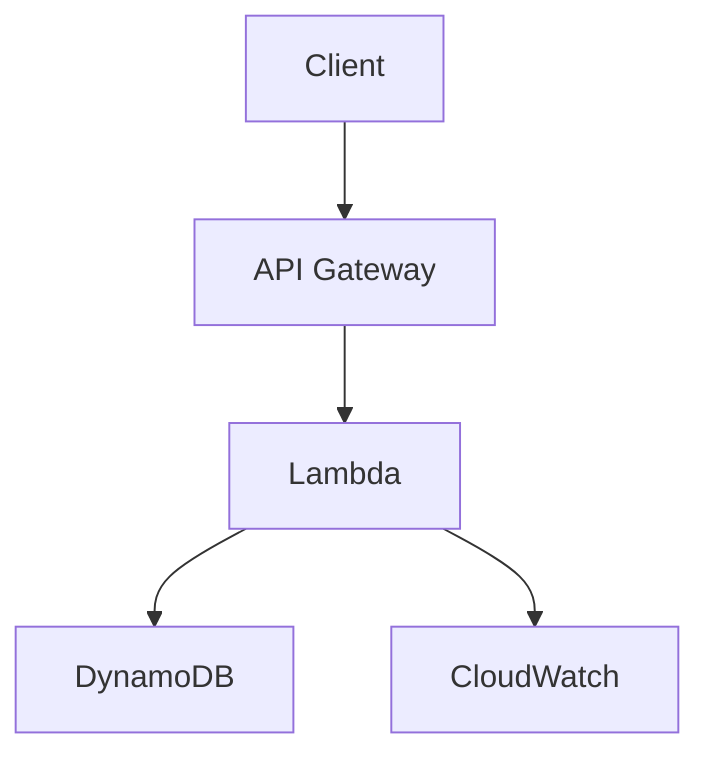

# Phase 9: Documentation & Quick Wins - PRD

**Phase:** 9 of 10  
**Priority:** P2 (Nice to Have)  
**Estimated Duration:** 1 week  
**Dependencies:** Phase 1-6 (Core API complete)  
**Can be implemented in parallel with:** Phase 7, Phase 8, Phase 10

---

## 1. Executive Summary

Phase 9 focuses on documentation improvements and quick configuration wins. This includes comprehensive documentation enhancements, retry logic guides, API versioning strategy, and Lambda performance configuration. These improvements enhance developer experience without requiring significant code changes.

**Goal:** Comprehensive documentation and quick performance/config improvements.

---

## 2. Scope

### In Scope
- Architecture documentation with diagrams
- Troubleshooting guide
- Performance tuning guide
- Retry logic documentation and examples
- API versioning strategy documentation
- Lambda provisioned concurrency configuration
- Enhanced existing documentation

### Out of Scope
- Code changes (except configuration)
- New API features
- Testing infrastructure
- Advanced features

---

## 3. Functional Requirements

### 3.1 Architecture Documentation

**Purpose:** Provide clear system architecture overview.

**Content:**
- System architecture diagram (Mermaid)
- Component relationships
- Data flow diagrams
- Deployment architecture
- AWS service interactions

**Format:**
- Mermaid diagrams in Markdown
- Text descriptions
- Component explanations

**Files to Create:**
- `docs/ARCHITECTURE.md` - Architecture documentation

**Success Criteria:**
- Architecture is clearly documented
- Diagrams are accurate and up-to-date
- Components are explained

---

### 3.2 Troubleshooting Guide

**Purpose:** Help developers resolve common issues.

**Content:**
- Common error messages and solutions
- API key issues
- DynamoDB connection issues
- CORS issues
- Rate limiting issues
- Performance issues
- Debugging tips

**Format:**
- Problem → Solution format
- Code examples
- Step-by-step guides

**Files to Create:**
- `docs/TROUBLESHOOTING.md` - Troubleshooting guide

**Success Criteria:**
- Common issues are covered
- Solutions are clear and actionable
- Examples are provided

---

### 3.3 Performance Tuning Guide

**Purpose:** Help developers optimize API usage.

**Content:**
- Performance best practices
- Batch operations usage
- Filtering optimization
- Pagination best practices
- Connection pooling
- Caching strategies

**Format:**
- Best practices list
- Code examples
- Performance benchmarks

**Files to Create:**
- `docs/PERFORMANCE.md` - Performance tuning guide

**Success Criteria:**
- Best practices are documented
- Examples are provided
- Benchmarks are included

---

### 3.4 Retry Logic Documentation

**Purpose:** Guide developers on implementing retry logic.

**Content:**
- Retry strategy overview
- Exponential backoff explanation
- Retry examples (Python, JavaScript)
- Error handling best practices
- Idempotency considerations

**Format:**
- Guide with examples
- Code snippets
- Best practices

**Files to Update:**
- `docs/EXAMPLES.md` - Add retry patterns section
- `examples/python/examples/error_handling.py` - Add retry example
- `examples/javascript/examples/error-handling.js` - Add retry example

**Success Criteria:**
- Retry logic is clearly explained
- Examples work correctly
- Best practices are documented

---

### 3.5 API Versioning Strategy

**Purpose:** Document API versioning approach and migration strategy.

**Content:**
- Versioning policy
- Breaking vs non-breaking changes
- Migration guide for future versions
- Deprecation timeline process
- Version negotiation examples

**Format:**
- Policy document
- Migration examples
- Timeline templates

**Files to Update:**
- `docs/API.md` - Add versioning section
- `README.md` - Add versioning policy

**Success Criteria:**
- Versioning policy is clear
- Migration examples are provided
- Deprecation process is documented

---

### 3.6 Lambda Provisioned Concurrency

**Purpose:** Reduce Lambda cold starts for better performance.

**Requirements:**
- Configure provisioned concurrency in SAM template
- Add environment variable to control concurrency
- Update deployment scripts
- Document cost implications

**Configuration:**
- Provisioned concurrency: 2-5 instances (configurable)
- Environment variable: `PROVISIONED_CONCURRENCY`
- Cost documentation

**Files to Update:**
- `template.yaml` - Add provisioned concurrency config
- `scripts/deploy_aws.sh` - Add concurrency configuration
- `README.md` - Document concurrency configuration

**Success Criteria:**
- Provisioned concurrency is configured
- Cold starts are reduced
- Cost implications are documented

---

## 4. Technical Requirements

### 4.1 Documentation Structure

**New Files:**
```
docs/
├── ARCHITECTURE.md      # System architecture
├── TROUBLESHOOTING.md   # Troubleshooting guide
└── PERFORMANCE.md       # Performance tuning
```

**Updated Files:**
- `docs/API.md` - Versioning section
- `docs/EXAMPLES.md` - Retry patterns
- `README.md` - Versioning policy
- `examples/python/examples/error_handling.py` - Retry example
- `examples/javascript/examples/error-handling.js` - Retry example

---

### 4.2 Architecture Diagrams

**Diagrams to Create:**
1. System Architecture (high-level)
2. Component Architecture (detailed)
3. Data Flow Diagram
4. Deployment Architecture
5. Request Flow Diagram

**Tool:** Mermaid (Markdown-compatible)

**Example:**


---

### 4.3 Retry Logic Examples

**Python Example:**
```python
from tenacity import retry, stop_after_attempt, wait_exponential

@retry(
    stop=stop_after_attempt(3),
    wait=wait_exponential(multiplier=1, min=2, max=10)
)
def create_event_with_retry(client, event_data):
    return client.create_event(event_data)
```

**JavaScript Example:**
```javascript
async function createEventWithRetry(client, eventData, maxRetries = 3) {
  for (let i = 0; i < maxRetries; i++) {
    try {
      return await client.createEvent(eventData);
    } catch (error) {
      if (i === maxRetries - 1) throw error;
      await sleep(Math.pow(2, i) * 1000);
    }
  }
}
```

---

### 4.4 Lambda Provisioned Concurrency

**SAM Template Configuration:**
```yaml
Resources:
  TriggersApiFunction:
    Type: AWS::Serverless::Function
    Properties:
      ...
      AutoPublishAlias: live
      ProvisionedConcurrencyConfig:
        ProvisionedConcurrentExecutions: !Ref ProvisionedConcurrency
```

**Environment Variable:**
- `PROVISIONED_CONCURRENCY` - Number of provisioned instances (default: 2)

---

## 5. Implementation Steps

### Step 1: Architecture Documentation (Day 1)
1. Create architecture diagrams (Mermaid)
2. Write architecture documentation
3. Add component descriptions
4. Review and refine

### Step 2: Troubleshooting Guide (Day 2)
1. List common issues
2. Write solutions for each issue
3. Add code examples
4. Review and refine

### Step 3: Performance Tuning Guide (Day 3)
1. List performance best practices
2. Add code examples
3. Include benchmarks
4. Review and refine

### Step 4: Retry Logic Documentation (Day 4)
1. Write retry strategy guide
2. Add Python retry example
3. Add JavaScript retry example
4. Update example clients
5. Review and refine

### Step 5: API Versioning Strategy (Day 5, Morning)
1. Write versioning policy
2. Add migration examples
3. Update API documentation
4. Review and refine

### Step 6: Lambda Provisioned Concurrency (Day 5, Afternoon)
1. Update SAM template
2. Update deployment script
3. Add environment variable
4. Document cost implications
5. Test deployment

---

## 6. Success Metrics

### Documentation
- ✅ Architecture is clearly documented
- ✅ Troubleshooting guide covers common issues
- ✅ Performance guide is comprehensive
- ✅ Retry logic is clearly explained
- ✅ Versioning strategy is documented

### Configuration
- ✅ Provisioned concurrency is configured
- ✅ Cold starts are reduced
- ✅ Cost implications are documented

### Examples
- ✅ Retry examples work correctly
- ✅ Examples are clear and understandable

---

## 7. Testing Requirements

### Documentation Testing
- Review all documentation for accuracy
- Test all code examples
- Verify links work
- Check formatting

### Configuration Testing
- Test Lambda provisioned concurrency deployment
- Verify cold start reduction
- Test environment variable configuration

---

## 8. Documentation Standards

### Markdown Format
- Use consistent heading levels
- Include code blocks with syntax highlighting
- Add table of contents for long documents
- Use consistent formatting

### Diagrams
- Use Mermaid for all diagrams
- Keep diagrams simple and clear
- Include legends where needed

### Examples
- All code examples must be tested
- Include expected output
- Add comments for clarity

---

## 9. Out of Scope

- Code changes (except configuration)
- New API features
- Testing infrastructure
- Advanced features
- Video tutorials
- Interactive documentation

---

## 10. Dependencies

### Required
- Phase 1-6 complete (core API)
- Existing documentation structure

### Optional
- Mermaid support in documentation viewer
- Documentation hosting platform

---

## 11. Risks & Mitigation

### Risk 1: Documentation Accuracy
**Mitigation:** Review all documentation, test all examples, keep docs updated

### Risk 2: Provisioned Concurrency Costs
**Mitigation:** Document costs clearly, make it configurable, start with low concurrency

### Risk 3: Documentation Maintenance
**Mitigation:** Keep documentation in version control, review regularly, update with code changes

---

**Document Status:** Draft  
**Last Updated:** 2025-11-11

